# ROラトリオHUB

ROラトリオHUBは [ROラトリオ避難所](https://roratorio-hinanjo.net/roro/main/main.html) のソースコードをコピーして作られたラグナロクオンラインのダメージ計算機です。
ROラトリオ避難所に追加されていない2023年12月以降のアイテムデータで計算することを主な目的に作成されました。
ソースコードの再利用/公開を許可してくださったROラトリオ避難所の管理人様にはこの場を借りて改めてお礼申し上げます。

ROラトリオHUBは有志の個人による制作物ですが、ROラトリオHUBが取り扱うラグナロクオンラインはGravity、Lee MyoungJin、そしてガンホー・オンライン・エンターテイメント株式会社の著作物です。
そのため [ラグナロクオンライン著作物利用ガイドライン](https://ragnarokonline.gungho.jp/support/play-manner/copyright.html) に示された著作物の利用許諾事項にしたがって以下の権利表記を示します。

```
© Gravity Co., Ltd. & Lee MyoungJin(studio DTDS). All rights reserved.
© GungHo Online Entertainment, Inc. All Rights Reserved.
当コンテンツの再利用（再転載・配布など）は、禁止しています。
```

このリポジトリをForkして開発を続けてくださる有志の方には `当コンテンツの再利用（再転載・配布など）は、禁止しています。` という一文が混乱を招くかもしれませんが、
このリポジトリは [ライセンス](./LICENSE) で定義された条件を満たす限りは自由にご利用頂けます。
ラグナロクオンラインの著作者様方の権利を侵害せず、できる限り自由にソースコードを取り扱っていただくために PolyForm NonCommercial License を掲げています。
ROラトリオHUBの開発に関わる方はぜひご一読ください。

# ブランチの運用方針

ROラトリオHUBは3つの基本ブランチで運用されています。

- dev  
本番環境で公開される前の様々なコードを試行錯誤するブランチです。
Forkされたリポジトリからも積極的にPull Requestを受け入れています。
ROラトリオHUBにコードを提案してくださる方はここから新しいブランチを作成してください。
- master  
十分な確認が済んだコードを格納するブランチです。
リポジトリ管理者がdevブランチを手動でPull Request/Mergeすることで更新します。
- gh-pages  
ROラトリオHUBをWebサイトとして公開するためのブランチです。
masterブランチに対するMergeをトリガーとして自動的にデプロイされます。

